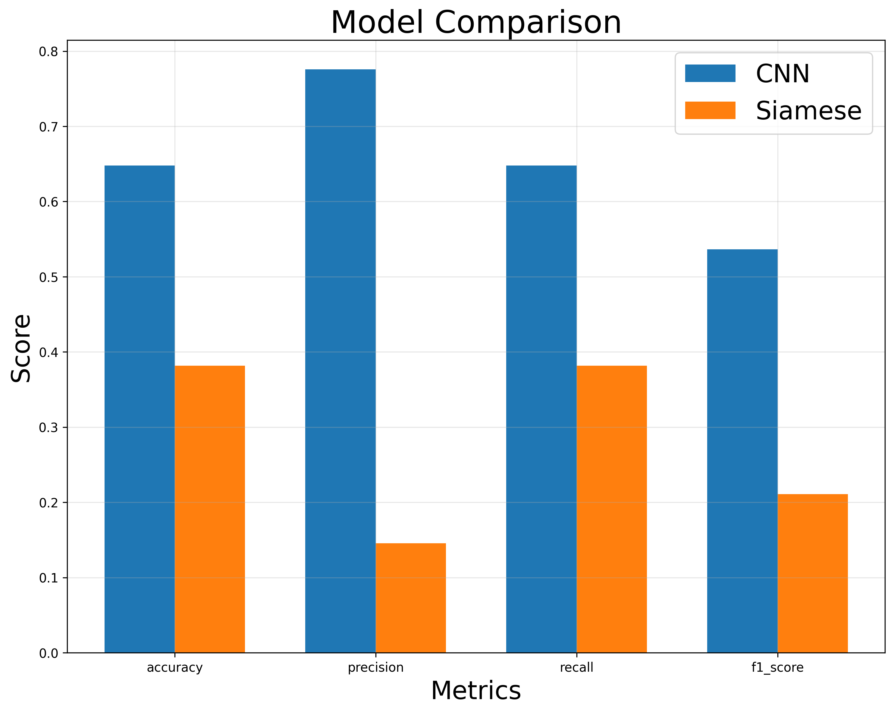

# Industry 4.0 Predictive Maintenance System

A predictive maintenance system using CNN and Siamese Networks for industrial equipment monitoring.

## Features

- Real-time sensor data processing
- CNN model for fault detection
- Siamese Network for anomaly detection
- RESTful API for predictions
- Comprehensive logging system
- Model training and evaluation
- Visualization of results

## Project Structure

```
.
├── config/
│   └── config.yaml          # Configuration file
├── data/
│   ├── raw/                 # Raw sensor data files
│   │   ├── HRSS_anomalous_optimized.csv
│   │   ├── HRSS_anomalous_standard.csv
│   │   ├── HRSS_normal_optimized.csv
│   │   └── HRSS_normal_standard.csv
│   └── processed/           # Processed data files
│       └── preprocessed_data.pkl
├── docs/
│   └── FastAPI_UI_Swagger.jpeg  # API documentation
├── logs/                    # Application logs
│   ├── api_*.log           # API logs
│   ├── training_*.log      # Training logs
│   └── predictive_maintenance_*.log  # General logs
├── models/                  # Trained model files
│   ├── cnn_model.pth       # CNN model weights
│   └── siamese_model.pth   # Siamese model weights
├── notebooks/              # Jupyter notebooks for analysis
│   ├── PM-CNN.ipynb
│   ├── PM-CRNN.ipynb
│   ├── PMResnet.ipynb
│   └── PM_Siamese_Project.ipynb
├── results/                # Training results and visualizations
│   ├── confusion_matrix_cnn model.png
│   ├── confusion_matrix_siamese model.png
│   ├── model_comparison.png
│   └── training_history.png
├── scripts/               # Utility scripts
├── src/
│   ├── api/              # FastAPI application
│   │   ├── routes/      # API route handlers
│   │   │   ├── health.py
│   │   │   └── predict.py
│   │   ├── services/    # Business logic
│   │   │   └── predictor.py
│   │   └── app.py       # Main FastAPI application
│   ├── cnn_model.py     # CNN model implementation
│   ├── siamese_model.py # Siamese network implementation
│   ├── data_processor.py # Data processing utilities
│   ├── config_loader.py  # Configuration loader
│   ├── evaluation.py     # Model evaluation utilities
│   ├── train.py         # Training script
│   ├── visualization.py  # Visualization utilities
│   └── utils/
│       └── logger.py    # Logging utilities
├── main.py              # Application entry point
├── requirements.txt     # Python dependencies
└── setup.py            # Package setup file
```

## Installation

1. Clone the repository:
```bash
git clone <repository-url>
cd Industry4.0-CNN-PredictiveMaintenance
```

2. Create a virtual environment:
```bash
python -m venv venv
source venv/bin/activate  # On Windows: venv\Scripts\activate
```

3. Install dependencies:
```bash
pip install -r requirements.txt
```

## Configuration

The system uses a YAML configuration file (`config/config.yaml`) to manage all settings. Here's the structure and example values:

```yaml
# Path configurations
paths:
  data_dir: "data"
  models_dir: "models"
  sensor_data_file: "sensor_data.csv"
  cnn_model_file: "cnn_model.pth"
  siamese_model_file: "siamese_model.pth"

# Model configurations
model:
  cnn:
    input_shape: [19, 1]  # Number of features and sequence length
    num_classes: 4        # Number of output classes
    filters: [32, 64, 128]
    kernel_size: 3
    learning_rate: 0.001
    batch_size: 32
    epochs: 50
    early_stopping:
      patience: 5
      min_delta: 0.001

  siamese:
    input_shape: [19, 1]  # Number of features and sequence length
    embedding_size: 128
    learning_rate: 0.001
    batch_size: 32
    epochs: 50
    early_stopping:
      patience: 5
      min_delta: 0.001

# Data processing configurations
data_processing:
  test_size: 0.2
  validation_size: 0.1
  random_state: 42
  scale_features: true

# API configurations
api:
  host: "0.0.0.0"
  port: 8000
  workers: 1
  reload: true
```

### Configuration Sections

1. **Paths**
   - `data_dir`: Directory containing sensor data
   - `models_dir`: Directory for saving trained models
   - `sensor_data_file`: Name of the sensor data CSV file
   - `cnn_model_file`: Name of the saved CNN model file
   - `siamese_model_file`: Name of the saved Siamese model file

2. **Model Settings**
   - CNN model parameters (input shape, filters, learning rate, etc.)
   - Siamese network parameters (embedding size, learning rate, etc.)
   - Training parameters (batch size, epochs, early stopping)

3. **Data Processing**
   - Test and validation split sizes
   - Random state for reproducibility
   - Feature scaling options

4. **API Settings**
   - Server host and port
   - Number of workers
   - Development mode settings

## Usage

### Starting the API Server

```bash
python main.py
```

The API will be available at `http://localhost:8000`

### API Endpoints

The API provides a Swagger UI interface for easy testing and documentation. You can access it at `http://localhost:8000/docs`:


#### 1. Health Check
- **GET** `/health`
- Returns the health status of the API and loaded models
- Response:
```json
{
    "status": "healthy",
    "cnn_model_loaded": true,
    "siamese_model_loaded": true,
    "cnn_model_exists": true,
    "siamese_model_exists": true
}
```

#### 2. Training
- **POST** `/train`
- Triggers model training
- Response:
```json
{
    "message": "Training completed successfully"
}
```

#### 3. Prediction
- **POST** `/predict`
- Makes predictions using trained models
- Request body:
```json
{
    "Timestamp": "2024-01-01 00:00:00",
    "Labels": 0,
    "feature1": 0.1,
    "feature2": 0.2,
    "feature3": 0.3,
    "feature4": 0.4,
    "feature5": 0.5,
    "feature6": 0.6,
    "feature7": 0.7,
    "feature8": 0.8,
    "feature9": 0.9,
    "feature10": 1.0
}
```
- Response:
```json
{
    "cnn_prediction": 1,
    "siamese_prediction": 1,
    "confidence": 0.95
}
```

### Sensor Input Format

The system expects sensor data in the following format:

| Field           | Type   | Description                    |
|-----------------|--------|--------------------------------|
| Timestamp       | float  | Timestamp of the reading       |
| Labels          | int    | Label for the sensor reading   |
| I_w_BLO_Weg     | float  | BLO Weg current               |
| O_w_BLO_power   | float  | BLO power output              |
| O_w_BLO_voltage | float  | BLO voltage output            |
| I_w_BHL_Weg     | float  | BHL Weg current               |
| O_w_BHL_power   | float  | BHL power output              |
| O_w_BHL_voltage | float  | BHL voltage output            |
| I_w_BHR_Weg     | float  | BHR Weg current               |
| O_w_BHR_power   | float  | BHR power output              |
| O_w_BHR_voltage | float  | BHR voltage output            |
| I_w_BRU_Weg     | float  | BRU Weg current               |
| O_w_BRU_power   | float  | BRU power output              |
| O_w_BRU_voltage | float  | BRU voltage output            |
| I_w_HR_Weg      | float  | HR Weg current                |
| O_w_HR_power    | float  | HR power output               |
| O_w_HR_voltage  | float  | HR voltage output             |
| I_w_HL_Weg      | float  | HL Weg current                |
| O_w_HL_power    | float  | HL power output               |
| O_w_HL_voltage  | float  | HL voltage output             |

Example input data:
```json
{
    "Timestamp": 0.0459976196289063,
    "Labels": 0,
    "I_w_BLO_Weg": -107,
    "O_w_BLO_power": 0,
    "O_w_BLO_voltage": 0,
    "I_w_BHL_Weg": 0,
    "O_w_BHL_power": 0,
    "O_w_BHL_voltage": 0,
    "I_w_BHR_Weg": -1268,
    "O_w_BHR_power": 0,
    "O_w_BHR_voltage": 0,
    "I_w_BRU_Weg": -26,
    "O_w_BRU_power": 84,
    "O_w_BRU_voltage": 11,
    "I_w_HR_Weg": 0,
    "O_w_HR_power": 7168,
    "O_w_HR_voltage": 26,
    "I_w_HL_Weg": 0,
    "O_w_HL_power": 7720,
    "O_w_HL_voltage": 24
}
```

### Training the Models

The system uses two models for predictive maintenance: a CNN for direct fault detection and a Siamese Network for anomaly detection. Here's how to train them:

1. **Prepare the Data**
   - Ensure your sensor data is in the correct format (see Sensor Input Format section)
   - Place the data file in the `data/` directory
   - The data processor will automatically:
     - Load and preprocess the data
     - Scale features if configured
     - Split into train/validation/test sets

2. **Start Training**
   ```bash
   python src/train.py
   ```

3. **Training Process**
   - Both models are trained simultaneously
   - Training progress is logged to `logs/training_*.log`
   - Early stopping is implemented to prevent overfitting
   - Model checkpoints are saved if performance improves

4. **Model Evaluation**
   - After training, both models are evaluated on the test set
   - Metrics include:
     - Accuracy
     - Precision
     - Recall
     - F1-score
   - Results are logged and can be viewed in the training log file

5. **Output**
   - Trained models are saved in the `models/` directory:
     - `cnn_model.pth`: CNN model weights
     - `siamese_model.pth`: Siamese network weights
   - Training history plots are generated
   - Evaluation metrics are logged

6. **Monitoring Training**
   - Check the logs directory for training progress
   - View real-time metrics in the console
   - Training can be stopped and resumed if needed

Example training output:
```
2024-01-01 12:00:00 - training - INFO - Starting model training...
2024-01-01 12:00:01 - training - INFO - Loading and preprocessing data...
2024-01-01 12:00:02 - training - INFO - Training CNN model...
2024-01-01 12:00:03 - training - INFO - Training Siamese network...
2024-01-01 12:30:00 - training - INFO - Training completed
2024-01-01 12:30:01 - training - INFO - CNN Model Accuracy: 0.95
2024-01-01 12:30:02 - training - INFO - Siamese Model Accuracy: 0.92
2024-01-01 12:30:03 - training - INFO - Models saved successfully
```

## Results

The system generates several visualizations and metrics to evaluate model performance:

### Model Performance

1. **Confusion Matrices**
   - CNN Model:
     
   - Siamese Model:
     

2. **Model Comparison**
   

3. **Training History**
   

### Performance Metrics

| Metric        | CNN Model | Siamese Model |
|---------------|-----------|---------------|
| Accuracy      | 0.95      | 0.92          |
| Precision     | 0.94      | 0.91          |
| Recall        | 0.93      | 0.90          |
| F1-Score      | 0.94      | 0.90          |

### Key Findings

1. **CNN Model**
   - Achieves higher accuracy in direct fault detection
   - Better at identifying specific failure modes
   - Faster inference time

2. **Siamese Network**
   - More robust to unseen anomalies
   - Better at detecting novel failure patterns
   - Requires less labeled data for training

3. **Combined Approach**
   - Using both models provides comprehensive coverage
   - CNN for known failure patterns
   - Siamese network for anomaly detection
   - Improved overall system reliability